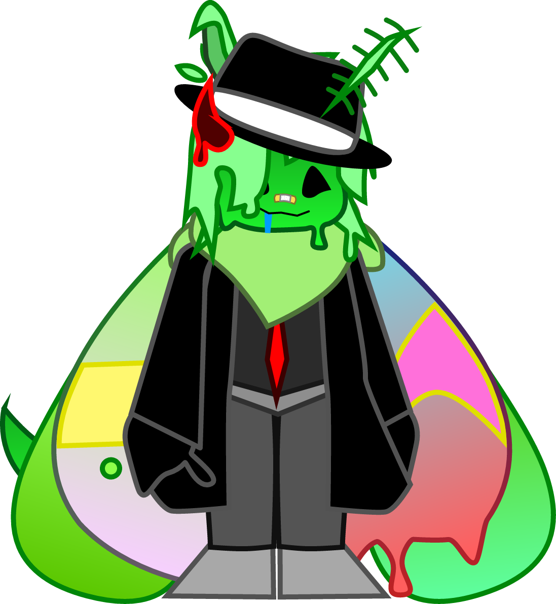
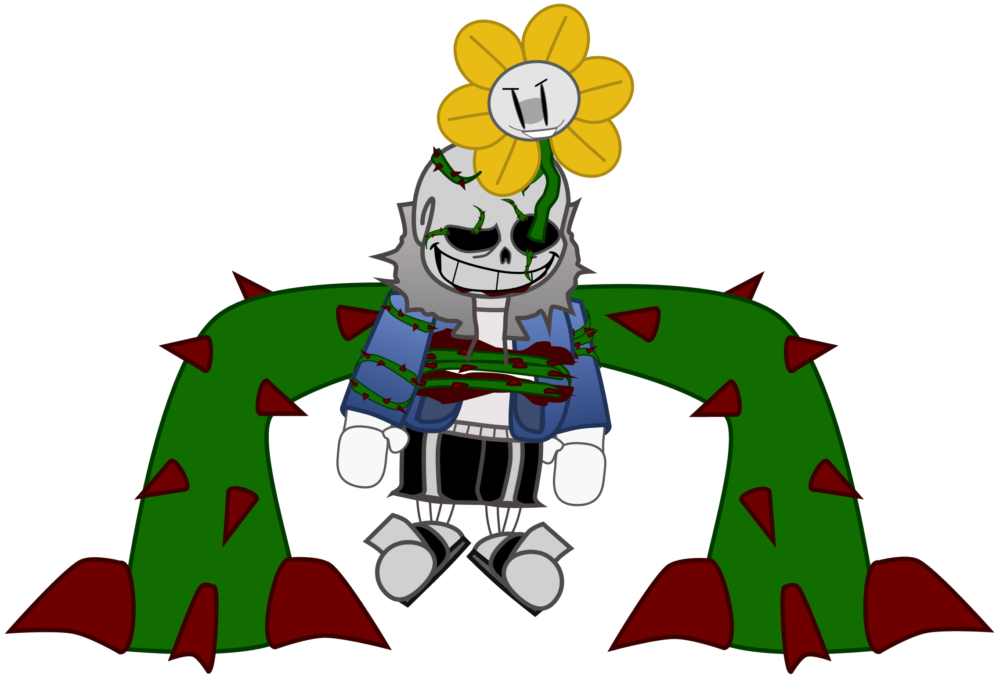
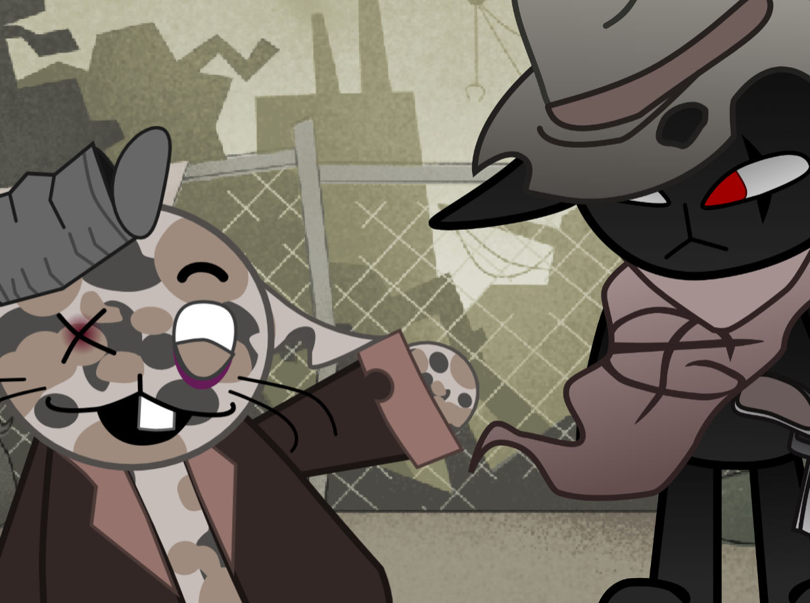

# 🦋 Hi, i'm Mario! 🦋
## You can also call me *Yian*, that's my online nickname.
### ~~Yes, i took it from Monster Hunter's Yian-Kut-Ku.~~

I'm an 18 year old with a special interest for programming, videogames, and basically technology in general! I also love moths, mainly because i used to raise silk moths. I like them so much my sona (the way i represent myself on the internet) is a moth!

bwehh

---

I've been into programming ever since **2020**, when i first got interested thanks to Scratch! 😺 Ironically enough, such a simple program helped me get into this world and also improve my drawing capabilities! (Now i use *vector programs* to draw thanks to it lmao).

#### Another example of a vector drawing (my sona already is one :P):

I still use Scratch to this day, but in the form of *Turbowarp*, a separate program that acts like Scratch but compiles the code to Javascript to make it run smoother. I've done multiple things, mainly games like FNAF and Undertale fangames. Of course, i'm still aiming to learn more complex programming languages, let's see how that goes!

---

More things i like:

- Pizza tower
- Mewgenics
- Oneshot
- Metroid
- Earthbound/Mother
- Terraria

*And many more! I suggest checking out my socials for more info!*

### [Twitter/X](https://x.com/Yian_kutkuc00t)

### [Straw Page](https://yiankutku.straw.page/)

### [Pronouns page](https://en.pronouns.page/@yiankutkucute)

### *My discord:* yiankutku13

